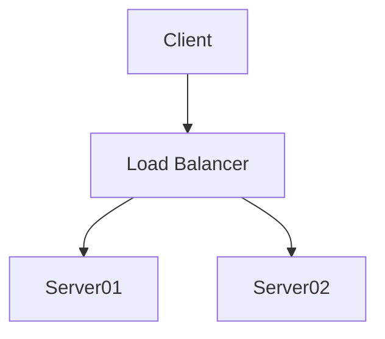

# exemples-mermaid

```mermaid
    graph TD 
    st{HI!}
    good((Great))
    bad((Mizzz))
    en>Goodbye!]
A((HI))
```
Here is a mermaid diagram:

```mermaid
    graph TD 
    A[Client] --> B[Load Balancer] 
    B --> C[Server01] 
    B --> D[Server02]
```

```mermaid
  gitGraph
    options
    {
        "nodeSpacing": 250,
        "nodeRadius": 50
    }
    end
    commit
    branch newbranch
    checkout newbranch
    commit
    commit
    checkout main
    commit
    commit
    merge newbranch
```