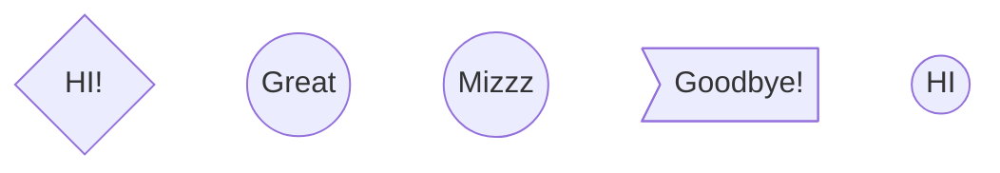

# exemples-mermaid

```mermaid
 graph TD 
 st{HI!}
 good((Great))
 bad((Mizzz))
 en>Goodbye!]
A((HI))
```

Here is a mermaid diagram:
    

        graph TD 
        A[Client] --> B[Load Balancer] 
        B --> C[Server01] 
        B --> D[Server02]
    

